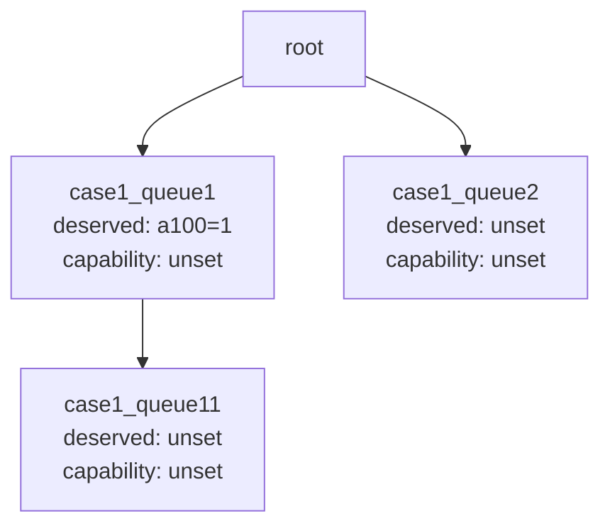
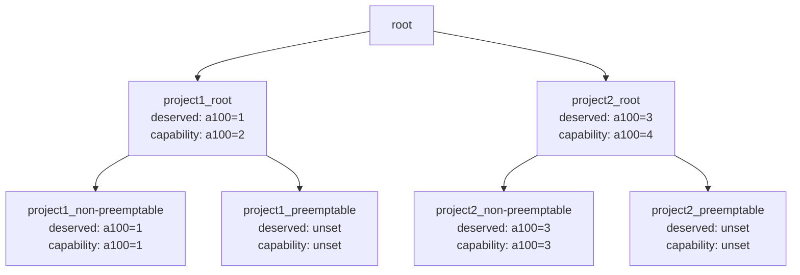
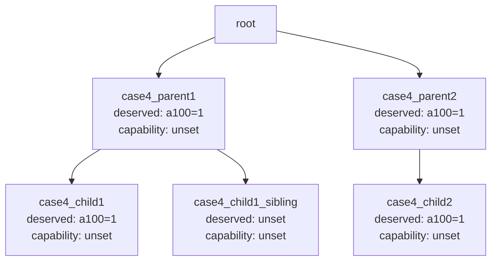
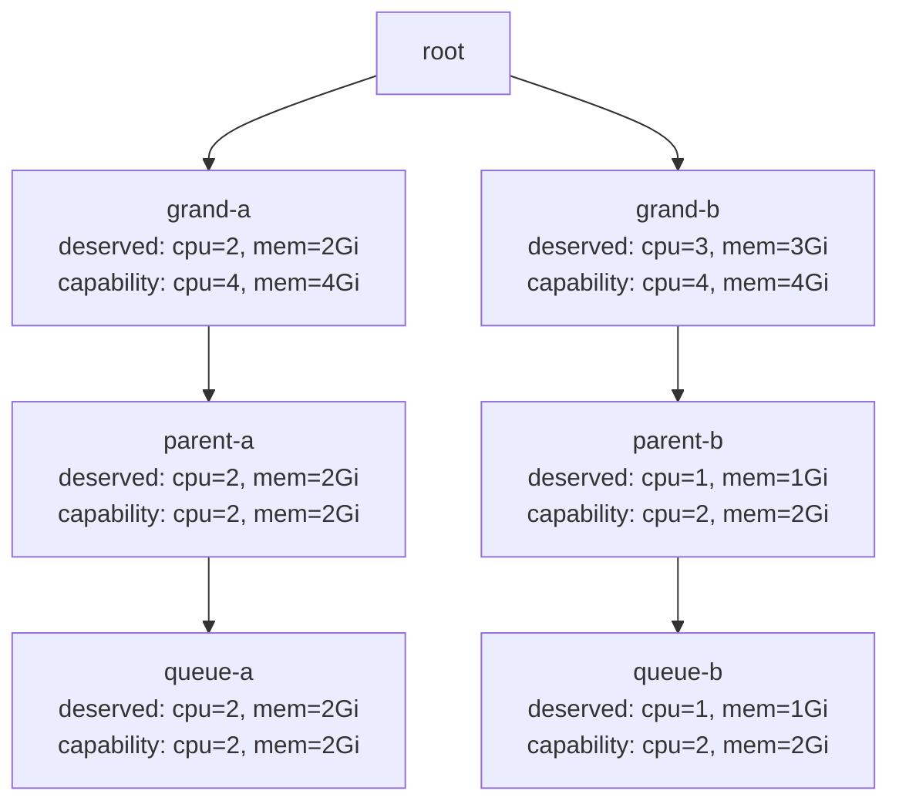
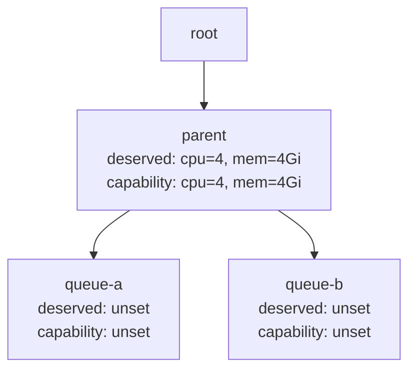
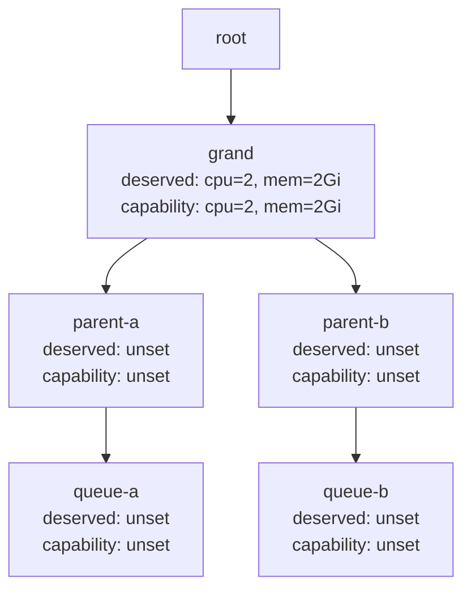
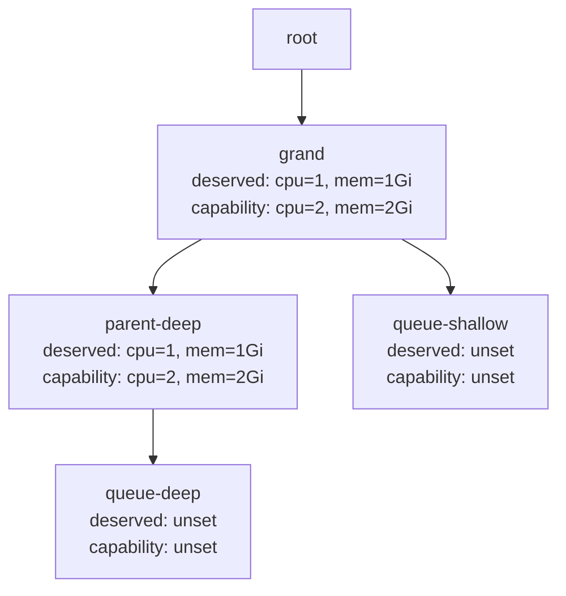
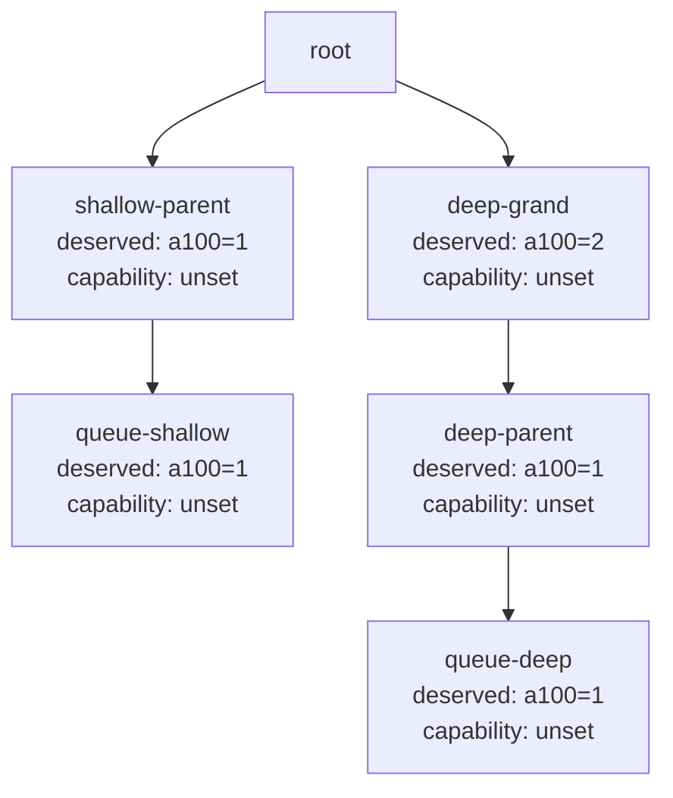

# Quota plugin

Status: implemented (`pkg/scheduler/plugins/quota`), without DRA quota; see "What stays in capacity".

## Motivation

The capacity plugin answers two different questions from one set of per-queue attributes. The
first is share: which queue goes next, which queue's pods are evicted first, whether an ask may
reclaim at all, whether a victim may be taken. Those compare allocated against `deserved` and
`guarantee`. The second is quota: whether a task may be allocated and whether a PodGroup may be
admitted. Those compare allocated against `capability`, up the hierarchy. Upstream enforces the
second as a boolean gate at allocate and at enqueue and nothing more.

Every quota feature this branch needed went into capacity because that is where the gate lives:
the admission past an ancestor's cap for a reclaim trial, the reserve of the share owed to admitted
jobs, and now the query the quota-aware reclaim round needs to know which ancestor blocks an ask.
Each one widens the fork's patch on a file upstream changes often.

The split puts the quota concern in its own plugin, `quota`, next to capacity. The session already
switches every extension point per plugin, so capacity can keep its share functions and give up its
quota ones by configuration alone. No framework change: the plugin keeps its own per-queue counters
from the same events every other plugin uses, which is what capacity, proportion and DRF each do
today, and the one new query is expressed through the existing allocatable hook.

## Ownership after the split

| Extension point | capacity | quota |
|---|---|---|
| queue order, victim queue order | keeps | |
| preemptive (ask within deserved) | keeps | |
| reclaimable (victim over deserved, ancestor level, guarantee floor) | keeps | |
| allocatable (capability up the hierarchy, reserve, scheduling-gate reserved tasks) | off | owns |
| job enqueueable (capability admission, ancestor-cap reclaim trial) | off | owns |
| job enqueued (inqueue accounting, reserve, trial tag) | off | owns |
| blocking ancestor query for the quota-aware reclaim round | | owns |
| DRA quota (`dynamicResourceAllocation`, consumable capacity) | keeps, see below | |
| hint provider for the unschedulable-job cache | keeps | own, same shape |

Capacity runs with `enabledAllocatable: false` and `enableJobEnqueued: false`. Its hierarchy stays
on, since its share functions need the tree. The session's allocatable and enqueueable aggregators
skip plugins with those flags off, so there is exactly one enforcer of capability.

## The plugin

### Attributes

Per queue, rebuilt at session open from the session's queues and jobs:

- the tree: ancestors from the root, children; the root's capability is infinite when unset;
- `capability` from the spec, inheriting unset cpu, memory and scalar dimensions from the parent;
- `realCapability`: the parent's real capability minus the guarantees of the parent's other
  children, plus the queue's own guarantee, capped by its own capability. The same hold-back
  formula capacity uses; it is the capacity a queue can actually reach when every sibling takes its
  guarantee;
- `deserved`, raised to `guarantee`, for the reserve and for the entitlement test of the trial;
- `allocated`: the requests of every task in an allocated status (bound, binding, running,
  allocated), summed to every ancestor; a terminating pod is not counted;
- `inqueue`: the unplaced `minResources` of Inqueue PodGroups and of running PodGroups that have
  reached `minMember`, deducting scheduling-gated requests, summed to every ancestor;
- `elastic`: usage above `minResources` of running jobs, the credit the enqueue check gives back;
- `reserve`: for a leaf, the unplaced `minResources` of its Inqueue jobs up to its deserved; for a
  parent, the sum over children capped by its own deserved. Only with `reserveDeserved`.

The formulas are copied from capacity on purpose, not shared: a shared package would move
upstream code, and the two plugins must be free to diverge on what they count. Both derive from
the same session, so their `allocated` agrees by construction.

### Events

Allocate and deallocate events add or subtract the task's request at its queue and every ancestor
and refresh the leaf's reserve. A task that passed the allocatable check while scheduling-gated is
held in a reserved set that counts against its queue until it is allocated, as capacity does under
the `SchedulingGatesQueueAdmission` gate.

### Allocatable

For a task of a leaf queue: the queue is open, and at the leaf and every ancestor
`allocated + reserved gated tasks + request + owed to other subtrees <= realCapability` on the
task's dimensions, where "owed to other subtrees" is the ancestor's reserve minus the reserve of the
child on the path to the task.

For an ancestor queue of the task's own queue, the same check restricted to that queue and above,
with the path and its reserve charges still taken from the task's job. This is the blocking-ancestor
query: an action that walks the task's queue ancestry calling `ssn.Allocatable` with each queue
finds the deepest queue that fails. Any other queue is refused. The leaf-only rule capacity applies
to its allocatable check is kept for leaves; the ancestor form exists for this query alone and never
allocates anything, since the actions only ever allocate to a job's own queue.

### Job enqueueable and enqueued

Admission is capacity's check, moved: `minResources + allocated + inqueue - elastic <=
realCapability` at the leaf and every ancestor. When only an ancestor's capability fails and
`enqueueAncestorCapReclaim` is on, the job is admitted on entitlement, as designed for the trial:
the leaf passes on its own, stays within its deserved after admission, and every failing ancestor
fails on capability only; the admission is refused when the dequeue action is not configured. The
enqueued hook adds `minResources` to inqueue at the leaf and every ancestor, registers the job as
owed its share, and tags a trial admission with the Inqueue condition the dequeue action reads.

### Arguments

```yaml
- name: quota
  enabledAllocatable: true
  enableJobEnqueued: true
  enableHierarchy: true
  arguments:
    enqueueAncestorCapReclaim: false   # admit past an ancestor cap for a reclaim trial
    reserveDeserved: false             # hold the owed deserved share at every ancestor
```

Flat queues work with `enableHierarchy: false`: the leaf is the only queue on every path, the
reserve has no parents to cap it and the trial has no ancestor to pass.

### Guard

At session open the plugin reads the tiers. If another plugin has `enabledAllocatable` or
`enableJobEnqueued` on while implementing those hooks on queue capability (capacity, proportion), it
logs once that capability is enforced twice and continues; two gates give the stricter answer, not a
wrong one, but the reserve and the trial only work when this plugin's gate is the one that counts.

### Enqueue admission on reclaimable ancestor capacity (detail)

The enqueue gate (`jobEnqueueable`, checked for the leaf and every ancestor by
`checkJobEnqueueableHierarchically`) models what can be freed with the `elastic` term only: a running job's
usage above its own `minResources`. Reclaim decides victims by a different model: a leaf's usage above its
`deserved`, filtered by the preemptable flag, `reclaimable`, the `guarantee` floor and gang. The two
disagree when a parent carries a `capability`, the holders have no elastic usage (PodGroups whose
`minResources` equal their usage, as the PodGroup controller creates them for bare pods), and an
under-deserved sibling asks: the gate rejects the job at the parent, the PodGroup stays Pending, and the
`reclaim` action skips Pending jobs. This is the enqueue-side form of
[volcano-sh/volcano#4817](https://github.com/volcano-sh/volcano/issues/4817); the reclaim-side form is
handled in the `reclaim` action's stop condition (`reclaimerFitsOnNode` includes `ssn.Allocatable`).

With the plugin argument `enqueueAncestorCapReclaim: true` (hierarchy mode only, default `false`), a job that
fails the gate is admitted by `enqueueableViaAncestorReclaim` for a trial by the reclaim action when, on every
requested dimension:

1. the leaf passes its own check unchanged;
2. the leaf stays at or under its `deserved` after admission, without elastic credit (a requested dimension
   missing from `deserved` counts as zero);
3. every failing ancestor fails on `realCapability` only (a DRA failure still rejects).

The gate establishes entitlement and nothing more. The trial is the real reclaim run in the same session:
the enqueued hook tags the PodGroup with an `Inqueue` condition whose reason is `AncestorCapReclaim`, the
reclaim action evaluates the job and records a verdict (`JobInfo.ReclaimResult`), and the dequeue action,
running after reclaim, returns the job to `Pending` on `ReclaimFailed` (victims existed, no node could be made
to fit, every tentative eviction rolled back) or on `ReclaimNoVictims` for a tagged job (the admission premise
was false). A failed trial persists only the two conditions; the `inqueue` reservation lasts one session and
the job is reconsidered after `enqueueBackoff`. The relaxed path is refused when the dequeue action is not
enabled (`conf.EnabledActionMap`), since nothing would revert a job reclaim cannot serve.

This replaces an earlier estimate of reclaimable slack in the gate. The estimate re-implemented the victim
rules and could be wrong in the conservative direction: an over-deserved victim can carry a resource the
queue is not over-deserved on (G9), which reclaim frees but an estimate keyed on deserved exceedance does not
see. The trial cannot be wrong, because it is reclaim itself. The rule is strictly all-dimension on the asker
side and never relaxes the leaf's own capability, in contrast to the approach in
[volcano-sh/volcano#4825](https://github.com/volcano-sh/volcano/pull/4825), which admitted on any single
dimension below `deserved` or `guarantee` and skipped the capability checks. `inqueue` accounting
(`JobEnqueuedFn`) is unchanged.

The table-driven test `Test_capacityPlugin_ReclaimOnAncestorCapacityStarvation` in the capacity package (section G), which configures this plugin next to capacity, covers the
default rejection, admission with reclaim in the same session, the trials that dequeue reverts (non-preemptable
holders, `reclaimable: false`, holders at `deserved`, victims that cannot free enough, victims spread over
nodes), the entitlement rejection (a leaf over `deserved` on one dimension), the cpu+gpu case the estimate
got wrong, and the refusal when the dequeue action is absent.

#### Unit test scenarios and behavior map

The table-driven test `Test_capacityPlugin_AncestorReclaimScenarios` covers case1-case11 with explicit topologies and reclaim outcomes.

**case1: Can reclaim based on parent deserved when ancestorReclaimLevel is 1**



- Workloads: `p1` running on `n1` in `case1_queue2` requests `a100=4`; `p2` pending in `case1_queue11` requests `a100=1`.
- Level: `ancestorReclaimLevel=1`.
- Expected: `p1` is evicted and `p2` (podgroup `pg2`) is pipelined to `n1`.

**case2: Cross-parent reclaim pipelines project1 pending job when project2 child and parent are both over deserved**



- Workloads: `p1..p4` running on `n1` in `project2_preemptable` (`a100=1` each), `p5` pending in `project1_preemptable` (`a100=1`).
- Level: `ancestorReclaimLevel=1`.
- Expected: lower-priority `p4` is evicted and `p5` (podgroup `pg5`) is pipelined to `n1`.

**case3: Cross-parent reclaim can evict sibling-queue victim first**

Queue topology is identical to case2.

- Workloads: continuation-style state with `p1..p3` running on `n1` in `project2_preemptable` (`a100=1` each), `p4` pending as reclaimed (`a100=1`), `p5` already running in `project1_preemptable` (`a100=1`), and `p6` pending in `project2_non-preemptable` (`a100=1`).
- Level: `ancestorReclaimLevel=1`.
- Expected: `p3` is evicted and `p6` (podgroup `pg6`) is pipelined to `n1`.

**case4: Cross-parent reclaim is blocked when victim child is not over deserved**



- Workloads: `p1` running on `n1` in `case4_child1` (`a100=1`), `p3` running in sibling queue (non-preemptable, `a100=1`), `p2` pending in `case4_child2` (`a100=1`).
- Level: `ancestorReclaimLevel=1`.
- Expected: no eviction and no pipeline.

**case5: level 0 allows reclaim based on leaf-level deserved checks**



- Workloads: `p-victim` running in `queue-b` (`cpu=2, mem=2Gi`), `p-reclaimer` pending in `queue-a` (`cpu=2, mem=2Gi`).
- Level: `ancestorReclaimLevel=0`.
- Expected: `p-victim` is evicted and `p-reclaimer` is pipelined.

**case6: level 1 allows reclaim when parent-level check passes**

Queue topology is identical to case5.

- Workloads: same as case5.
- Level: `ancestorReclaimLevel=1`.
- Expected: parent-level check passes, so eviction/pipeline still happens.

**case7: level 2 blocks reclaim when grandparent-level check fails**

Queue topology is identical to case5.

- Workloads: same as case5.
- Level: `ancestorReclaimLevel=2`.
- Expected: grandparent-level gate fails; no eviction and no pipeline.

**case8: level 1 blocks sibling reclaim when leaf deserved is unset and no ancestor gate applies**



- Workloads: `p-victim` running in `queue-b` (`cpu=2, mem=2Gi`), `p-reclaimer` pending in `queue-a` (`cpu=2, mem=2Gi`).
- Level: `ancestorReclaimLevel=1`.
- Expected: no eviction and no pipeline.

**case9: level 2 blocks reclaim when leaf deserved is unset and queues share grandparent**



- Workloads: `p-victim` running in `queue-b` (`cpu=2, mem=2Gi`), `p-reclaimer` pending in `queue-a` (`cpu=2, mem=2Gi`).
- Level: `ancestorReclaimLevel=2`.
- Expected: no eviction and no pipeline.

**case10: level 2 blocks reclaim in unbalanced shared-grandparent tree when leaf deserved is unset**



- Workloads: `p-victim` running in `queue-deep` (`cpu=2, mem=2Gi`), `p-reclaimer` pending in `queue-shallow` (`cpu=2, mem=2Gi`).
- Level: `ancestorReclaimLevel=2`.
- Expected: no eviction and no pipeline. Although `grand` is over deserved, the victim leaf and reclaimer leaf both have no relevant deserved resources for the requested `cpu`/`memory`. Because the queues share `grand` within `ancestorReclaimLevel=2`, the leaf-level contention-avoidance gate skips reclaim before the grandparent deserved check can make the victim eligible.

**case11: unbalanced level2 blocks reclaim when depth-2 ancestor is not over deserved**



- Workloads: `p-victim` running in `queue-deep` requests `a100=2`; `p-reclaimer` pending in `queue-shallow` requests `a100=1`.
- Level: `ancestorReclaimLevel=2`.
- Expected: depth-2 ancestor gate fails; no eviction and no pipeline.

**Note:** The above modifications are primarily applicable when `EnabledHierarchy` is set to true. If the capacity plugin does not require hierarchical queue management, the existing implementations of these functions will be retained.

### Reserving the deserved share of admitted jobs (detail)

Plugin argument `reserveDeserved` (default `false`). Without it, `deserved` is enforced only by reclaim:
the allocatable check compares `allocated + request` with `realCapability` at the leaf and every
ancestor, and an over-deserved queue can consume a parent's capability that an under-deserved sibling
with an admitted job is waiting for. Right after a reclaim this lets the victim's replacement take the
freed space ahead of the job the eviction served.

With the argument on, every `queueAttr` carries a `reserve`, rebuilt per session and kept live by the
allocate and deallocate event handlers (and the job-enqueued handler for jobs admitted in-session):

```
leaf:   reserve = clamp0(min(deserved, allocated + unplaced) - allocated)         per dimension
        unplaced = Σ over Inqueue jobs with minResources of
                   clamp0(minResources - resources of tasks in allocated status or Pipelined)
                   (gated pods deducted as for the inqueue term)
parent: reserve = min(Σ children.reserve, clamp0(deserved - allocated))           per dimension
        (a dimension with no deserved on the parent passes the children's sum through)
```

The allocatable check then charges each ancestor on the candidate's path with
`clamp0(ancestor.reserve - pathChild.reserve)`:

```
allocated + queueGateReserved + request + reservedByOthers <= realCapability
```

on the candidate's dimensions. The leaf check is unchanged, and the candidate's own subtree keeps its
owed share available to itself. The reservation is not a node reservation: two queues both within
their `deserved` still compete for a freed node slot in queue order. The simulated allocatable check
used by the gangpreempt and gangreclaim actions does not charge the reserve.

## What stays in capacity, and why

DRA quota stays with capacity for now: its simulate hooks and consumable-capacity checks are tied
to capacity's attributes and to the allocatable check it runs during simulation. A deployment that
enforces DRA quota keeps capacity's allocatable on and does not use the quota plugin, until the DRA
side is moved as a second step. The guard above makes the overlap visible.

The ancestor reclaim level stays with capacity: it filters victims by deserved, which is share.

## Configuration

```yaml
actions: "enqueue, allocate, backfill, reclaim, dequeue"
tiers:
- plugins:
  - name: priority
  - name: gang
  - name: conformance
- plugins:
  - name: drf
  - name: predicates
  - name: capacity
    enabledAllocatable: false
    enableJobEnqueued: false
    enableHierarchy: true
    arguments:
      ancestorReclaimLevel: 2
  - name: quota
    enableHierarchy: true
    arguments:
      enqueueAncestorCapReclaim: true
      reserveDeserved: true
  - name: nodeorder
  - name: binpack
configurations:
  - name: reclaim
    arguments:
      victimSelection: bestFit
      crossNodeVictims: true
```

## What was done

1. Package `pkg/scheduler/plugins/quota`, registered in the plugin factory: attributes, events,
   allocatable in both forms, enqueueable, enqueued, the reserved set for gated tasks, the capacity
   hint provider reused. No metrics of its own yet.
2. The ancestor-cap admission and the reserve moved out of capacity, which is back to upstream
   (the ancestor reclaim level is upstream already). The constants the dequeue action reads (the
   Inqueue condition reason) live in the api package and did not move.
3. The gap table, the two-session reserve test and the victim selection tests configure both
   plugins as above; the reserve arithmetic and argument unit tests live in the quota package.
4. The quota-aware reclaim round is built against the ancestor form of `ssn.Allocatable`, as
   described in [quota-aware-reclaim.md](quota-aware-reclaim.md).
5. Docs: the two moved sections form the [quota plugin user guide](../user-guide/how_to_use_quota_plugin.md);
   the dequeue design points at the quota plugin for the trial admission.

## Upstream angle

Nothing in capacity changes. The plugin is additive and off unless configured, and the only thing
other code needs from it is already an extension point. That is a smaller ask than the capacity
patches it replaces, but it still asks the maintainers to accept a second owner of the capability
concept, so the plugin should be proposed as what it is: a quota enforcer with reservations and a
reclaim trial, for hierarchies where capacity's gate alone leaves entitled jobs Pending.
